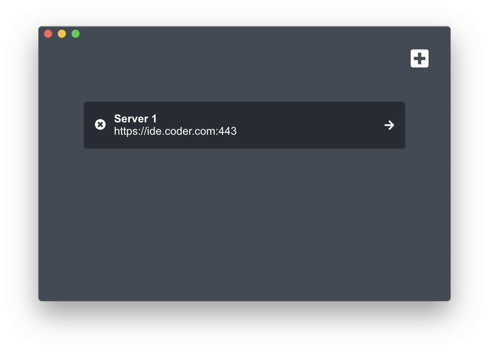
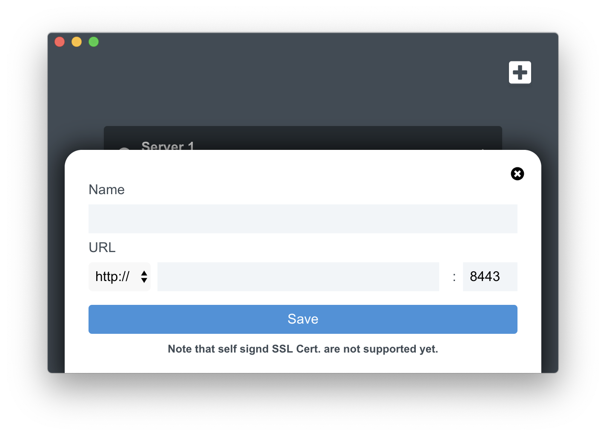

# Coder Connect 

Coder Connect is an Electron Based client to connect easier with your [code-server](https://coder.com) instance.

## Download 
It safes your URL and Port number. So you just need to click on the server to connect.
To test it yourself download this Repo, run `npm install` and `npm start`.
Or download the ready `.dmg` file from the Release Page.